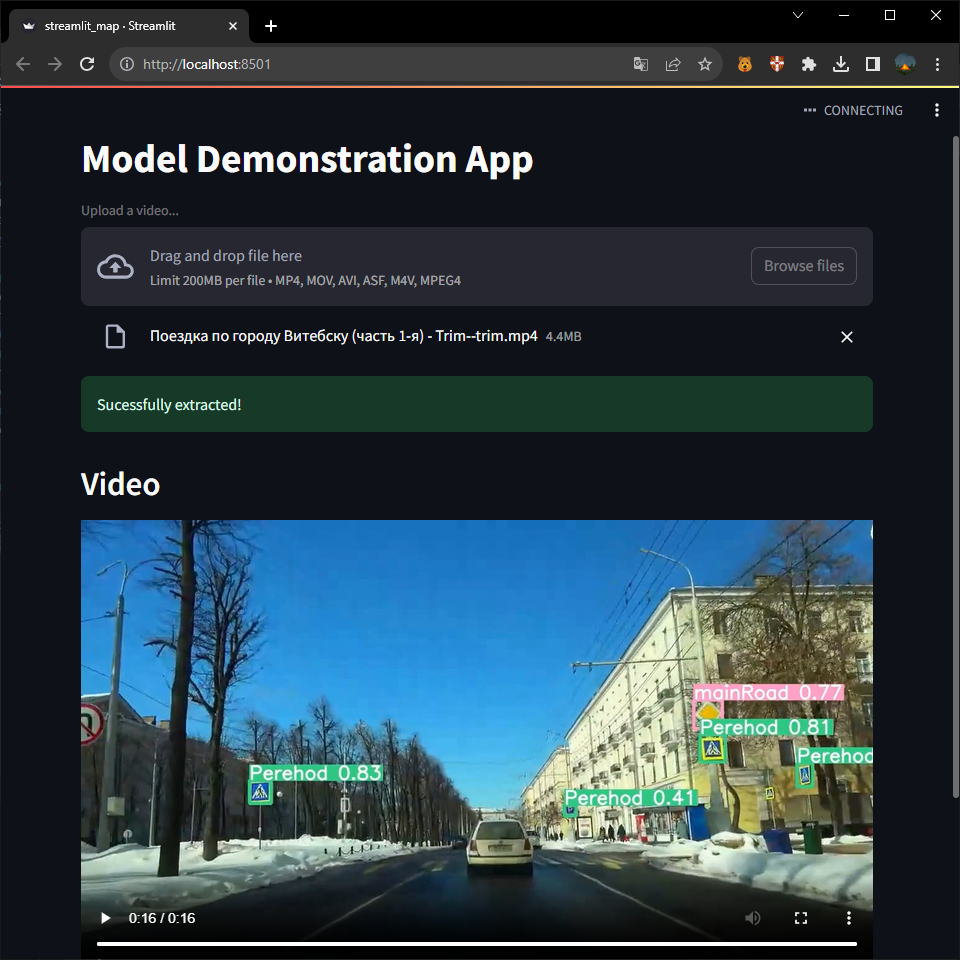

# DeepLearningPractice

Детекция дорожных знаков на видеорегистраторе.

##### Особенности и ограничения:
- В текущей версии приложения ограничение по размеру видео составляет 200 МБ. Это важно учитывать при загрузке видеоматериалов.
- **Загрузка файлов**: пользователи могут загружать видеофайлы в форматах, таких как mp4, mov, avi, asf, m4v и mpeg-4. Загрузка происходит способом drag and drop. Во время загрузки пользователь видит сообщение «Upload a video». После успешной загрузки пользователь видит сообщение «Upload successful!».
- **Обработка видео**: приложение обрабатывает видео с использованием CV-модели. После завершения обработки пользователь видит соответствующий индикатор: «Extracting complete!».
- **Video**: после обработки отображается загруженное видео с ограничивающей рамкой (bounding box) в месте, где модель детектировала дорожный знак.

Демо веб-приложения [реализовано](streamlit_page.py) с использованием фреймворка Streamlit.

