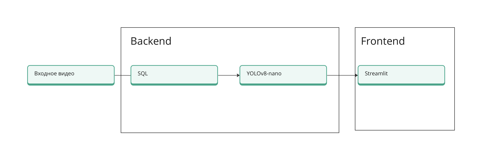

# Детекция дорожных знаков на видеорегистраторе

    
  
  
  
    

### Stack: 

### Репозиторий:

- assets - графические материалы для Readme файлика
- data_experiments - ноутбуки с обработкой датасетов
- model_experiments - ноутбуки с обучением моделек
- model_weights - лучшие веса обученных моделек

## Контент
- [Детекция дорожных знаков](#)
  - [Контент](#контент)
  - [Проблема](#проблема)
  - [Описание](#описание)
  - [Детекция знаков](#детекция-знаков)
    - [Данные](#данные)
    - [Статьи](#статьи)
    - [Видео](#видео)
    - [Архитектура](#архитектура)
    - [Демо](#демонстрация)
      - [Особенности и ограничения](#особенности-и-ограничения-системы)
  - [Future Roadmap](#future-roadmap)
  - [Contibution](#contributing)
  - [Вывод](#conclusion)
  - [Авторы](#authors)

## Проблема
Данный продукт решает следующие проблемы:
* Автоматическая детекция знаков
* Удобный юзер интерфейс
* Быстрый инференс

## Описание
Предлагаемая система видеонаблюдения предназначена для обеспечения комплексного мониторинга и обнаружения дорожных знаков. 

Все собранные данные хранятся в централизованной базе данных для последующего анализа и обучения модели.

## Детекция знаков
### Данные
[Данные 1](https://www.kaggle.com/datasets/meowmeowmeowmeowmeow/gtsrb-german-traffic-sign )

[Данные 2](pytorch.org/vision/stable/generated/torchvision.datasets.GTSRB.html) 

[Данные 3](https://cg.cs.tsinghua.edu.cn/traffic-sign/)

[Данные 4](https://www.kaggle.com/datasets/valentynsichkar/traffic-signs-dataset-in-yolo-format/data) 

[Данные 5](https://universe.roboflow.com/cchegeu/russian-signs/model/14)

### Статьи
[Статья 1](https://www.researchgate.net/publication/346250677_Automatic_Traffic_Sign_Recognition_Artificial_Inteligence_-_Deep_Learning_Algorithm)

[Статья 2](https://link.springer.com/article/10.1007/s10639-022-11391-z)

### Видео
[Про разметку](https://www.youtube.com/watch?v=wjgnYyU6Ymc)

### Архитектура

    

### Frontend

#### Особенности и ограничения 
- В текущей версии приложения ограничение по размеру видео составляет 200 МБ. Это важно учитывать при загрузке видеоматериалов.
- **Загрузка файлов**: пользователи могут загружать видеофайлы в форматах, таких как mp4, mov, avi, asf, m4v и mpeg-4. Загрузка происходит способом drag and drop. Во время загрузки пользователь видит сообщение «Upload a video». После успешной загрузки пользователь видит сообщение «Upload successful!».
- **Обработка видео**: приложение обрабатывает видео с использованием CV-модели. После завершения обработки пользователь видит соответствующий индикатор: «Extracting complete!».
- **Video**: после обработки отображается загруженное видео с ограничивающей рамкой (bounding box) в месте, где модель детектировала дорожный знак.

## Future  Roadmap
- Проверить дополнительные архитектуры (Fast CNN, Faster CNN)
- Улучшить инференс
- Добавить трекинг знаков
- Улучшить взаимодействие с пользователем

## Contributing
Скопируйте файл [`contributing.md`](https://github.com/Svyatocheck/DeepLearningPractice/blob/master/contributing.md).

## Вывод
Предлагаемая система видеонаблюдения создает комплексное решение для мониторинга и детекция дорожных знаков.

Благодаря алгоритмам нейронных сетей, эффективному управлению данными и возможностям немедленного оповещения, он обеспечивает надежный 
инструмент для детекции знаков и может использоваться на реальных кейсах.

## Авторы
- [Vladimir Dimitrov](https://github.com/Vladimir-Dimitrov-Ngu)

